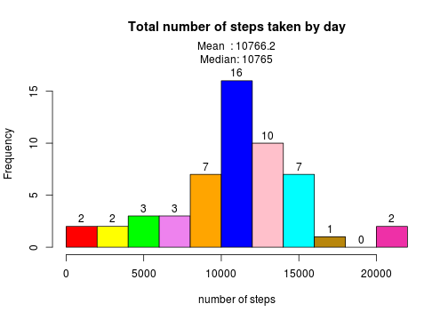

Johns Hopkins <span style="font-size:10pt"> Bloomberg School <i>of</i> Public Health</span>
========================================================
# <span style="color:#ff00ff">Reproducible Research: Peer Assessment 1</span>
## Loading and preprocessing the data

```r
# read and group data by day
act <- read.csv("activity.csv")
groupByDay <- aggregate(steps~date, data = act, FUN = sum)
```
## What is mean total number of steps taken per day?
The following histogram shows the mean and median total number of steps taken per day.
<br><b>Mean : 10766.2
<br>Median: 10765</b>

```r
# define some bin colors 
colors = c("red", "yellow", "green", "violet", "orange", 
           "blue", "pink", "cyan","darkgoldenrod","forestgreen","maroon2")
# show histogram
hist(groupByDay$steps,  # apply the hist-function 
     breaks = 10,       # number of intervals (bins - 1)
     right = FALSE,     # intervals closed on the left
     col = colors,      # color palette
     main = "Total number of steps taken by day",   
     xlab = "number of steps",
     labels = TRUE,
     ylim = c(0,18)    
     )
# calculate and display mean and median
s_mean <- formatC(mean(groupByDay$steps), format="f",digits=1)
s_median <- median(groupByDay$steps)
mtext(paste("Mean  :",s_mean),line=0)
mtext(paste("Median:",s_median),line=-1)
```

 
## What is the average daily activity pattern?
The following times series shows a maximum peek (206.2) at 08:35.

```r
s_avg <- aggregate(steps~interval, data = act, FUN = mean)
tx<-ts(s_avg,start=c(2012,10),frequency=24*60/5)
plot(steps~interval,tx,type="l",
     xlab = "5-Minute-Interval (3-hour-ticks)",
     ylab = "Average Number of Steps",
     col = "red",
     xaxt ="n"
     )
s_max<-s_avg[s_avg$steps==max(s_avg$steps),]
title(main="Average Daily Activity Pattern", col.main="black", font.main=4,line=2)
axis(1, at=seq(0,2400,by=300) )
mtext(paste("Maximum:", formatC(s_max$steps, format="f", digits=1),"at Interval",s_max$interval),side=3)
```

 
## Imputing missing values
There are <b>2304</b> steps missing (NA values).

```r
# missing values
n_na <-act[is.na(act$steps),]
nrow(n_na)
```

```
## [1] 2304
```
Missing are substitutes by the mean for that 5-minute interval.
The histogram made of the new dataset shows the following characteristics:
<ul>
<li>The 8 days with missing values go to the central bin.</li>
<li>Mean and Median now assume the same value.</li>
</ul>

The idea for the following snippet to replace the missing values was found 
[here](http://stackoverflow.com/questions/9322773/how-to-replace-na-with-mean-by-subset-in-r-impute-with-plyr)

```r
library(plyr)
impute.mean <- function(x) replace(x, is.na(x), mean(x, na.rm = TRUE))
act2 <- ddply(act, ~ interval, transform, steps = impute.mean(steps)
              ,interval=interval)
#plyr orders by group so we have to reorder
act2<-act2[order(act2$date,act2$interval), ] 

# some colors
colors = c("red", "yellow", "green", "violet", "orange", 
           "blue", "pink", "cyan","darkgoldenrod","forestgreen","maroon2") 
# group by day
groupByDay <- aggregate(steps~date, data = act2, FUN = sum)
# make histogram
hist(groupByDay$steps,  # apply the hist-function 
     breaks = 10,       # number of intervals (bins - 1)
     right = FALSE,     # intervals closed on the left
     col = colors,      # color palette
     main = "Total number of steps taken by day",   
     xlab = "number of steps",
     labels = TRUE,
     ylim = c(0,28)    
)
# calculate and display mean and median
s_mean <- formatC(mean(groupByDay$steps), format="f",digits=1)
s_median <-formatC(median(groupByDay$steps), format="f",digits=1)
mtext(paste("(replaced NA-steps with the mean for that 5min interval)"),line=0)
mtext(paste("Mean  :",s_mean),line=-1)
mtext(paste("Median:",s_median),line=-2)
```

 
## Are there differences in activity patterns between weekdays and weekends?
The following plot shows the differences in activity patterns between weekdays and weekends.
<ul>
<li>On weekends there is more activity all day long.</li>
<li>On weekdays there is a higher peek of activity earlier in the morning.</li> 
</ul>

```r
# add logical column
act2$daytype <- substr(weekdays(as.Date(act2$date)),1,1) == "S"
# split data in weekday and weekend
weekday<-subset(act2,daytype==FALSE)
weekend<-subset(act2,daytype==TRUE)

par(mfrow=c(2,1)) 
# Weekend
s_avg <- aggregate(steps~interval, data = weekend, FUN = mean)
tx<-ts(s_avg,start=c(2012,10),frequency=24*60/5)
plot(steps~interval,tx,type="l",
     xlab = "5-Minute-Interval (3-hour-ticks)",
     ylab = "Average Number of Steps",
     col = "red",
     xaxt ="n"
)
s_max<-s_avg[s_avg$steps==max(s_avg$steps),]
title(main="Average Daily Activity Pattern (Weekend)", col.main="black", font.main=4,line=2)
axis(1, at=seq(0,2400,by=300) )
mtext(paste("Maximum:", formatC(s_max$steps, format="f", digits=1),"at Interval",s_max$interval),side=3)

#Weekday
s_avg <- aggregate(steps~interval, data = weekday, FUN = mean)
tx<-ts(s_avg,start=c(2012,10),frequency=24*60/5)
plot(steps~interval,tx,type="l",
     xlab = "5-Minute-Interval (3-hour-ticks)",
     ylab = "Average Number of Steps",
     col = "red",
     xaxt ="n"
)
s_max<-s_avg[s_avg$steps==max(s_avg$steps),]
title(main="Average Daily Activity Pattern (Weekday)", col.main="black", font.main=4,line=2)
axis(1, at=seq(0,2400,by=300) )
mtext(paste("Maximum:", formatC(s_max$steps, format="f", digits=1),"at Interval",s_max$interval),side=3)
```

 
